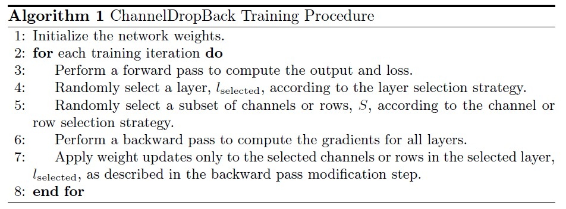
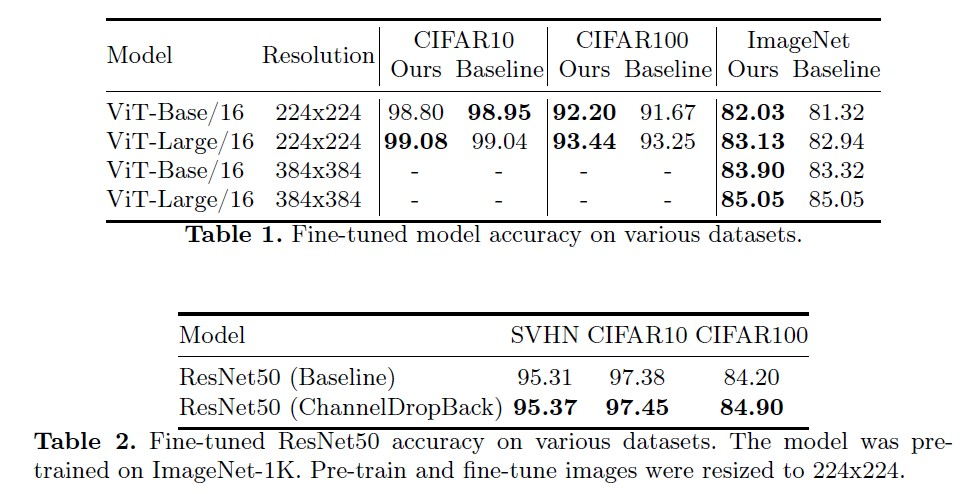
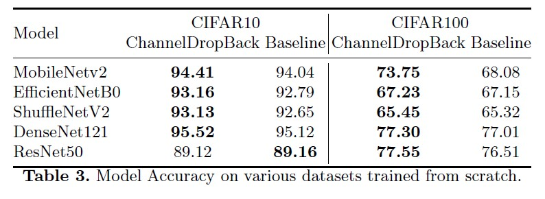

# ChannelDropBack: Forward-Consistent Stochastic Regularization for Deep Networks

## Description
Incorporating stochasticity into the training process of deep
convolutional networks is a widely used technique to reduce overfitting
and improve regularization. Existing techniques often require modifying
the architecture of the network by adding specialized layers, are effective
only to specific network topologies or types of layers - linear or convolu-
tional, and result in a trained model that is different from the deployed
one. We present ChannelDropBack, a simple stochastic regularization
approach that introduces randomness only into the backward informa-
tion flow, leaving the forward pass intact. ChannelDropBack randomly
selects a subset of channels within the network during the backpropaga-
tion step and applies weight updates only to them. As a consequence, it
allows for seamless integration into the training process of any model and
layers without the need to change its architecture, making it applicable
to various network topologies, and the exact same network is deployed
during training and inference. Experimental evaluations validate the ef-
fectiveness of our approach, demonstrating improved accuracy on popu-
lar datasets and models, including ImageNet and ViT. 



## Installation

```bash
git clone https://github.com/neiterman21/ChannelDropBack.git
cd ChannelDropBack
pip install -r requirements.txt
```
## Example
Here is an example script showing how to train a ResNet50 model using LayerDropBack on the CIFAR-100 dataset.

```
python train.py --model resnet50 --dataset cifar100
```

## Results
ChannelDropBack is a simple yet effective stochastic training approach that improves regularization in deep networks by introducing randomness exclusively
into the backward information flow during training. By randomly selecting a
subset of channels or rows for weight updates in a selected layer and preserving
the integrity of the forward pass, ChannelDropBack offers a universally applicable regularization technique, without requiring modifications to the network
architecture.




## Citation
If you find this project useful for your research, please use the following BibTeX entry.

        @inproceedings{channeldropback2025,
          title={ChannelDropBack: Forward-Consistent Stochastic Regularization for Deep Networks Regularization},
          author={},
          booktitle={},
          year={}
        }

